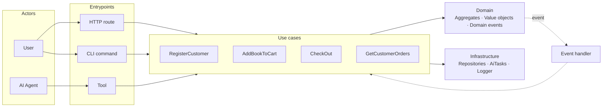

# Litmus

Litmus is a TypeScript framework for building reliable AI-powered apps. Most agent frameworks either reinvent or ignore decades of software engineering. Litmus exploits the overlap instead: proven primitives keep the deterministic parts simple, the same primitives make AI components tractable, and one testing discipline covers both deterministic logic and AI behaviour. Agent-as-actor falls out as a natural consequence: AI agents drive the same use cases that fire when a person clicks a button or runs a CLI command — different entrypoint, one system.

> **Agent or workflow?** "Agent" here means an LLM choosing its own steps at runtime. For features with known steps, prefer a _workflow_: compose `AiTask`s inside a `CommandHandler` with ordinary control flow. Deterministic control flow is easier to debug, cheaper, and faster — and it's still tested through the same use case surface. Reach for [`Agent`](#agent) only when the path through the system genuinely can't be enumerated up front.

## Why Litmus

Modern AI apps drift fast. LLM calls scatter through business logic. Evals lag the code they're meant to test. AI coding agents struggle to keep extending a codebase that's losing its shape.

**App as system; agent as actor.** Most agent frameworks treat the agent as the system. Litmus treats your application as the system. Steering an agent to behave reliably is its own discipline; Litmus doesn't pretend otherwise. What it does do is make the system the agent acts on stable, well-tested, and easy to extend — so the agent's job becomes "pick the right tool" rather than "reimplement the application". AI agents reach the system through the same use cases as a person hitting an HTTP route or running a CLI command.

**Bounded autonomy.** An `Agent` has a defined scope: the tools it can pick from, the goal it's pursuing. Tools are wrapped use cases, so an agent's reach into the system is the same surface a human or a script would use. The rest of your code never sees an LLM directly.

**TDD-first, including for AI.** Litmus encourages outside-in TDD — [acceptance tests](https://continuous-delivery.co.uk/downloads/ATDD%20Guide%2026-03-21.pdf) on the outside, smaller tests inside. Evaluations are acceptance tests with a probabilistic shell, not a separate testing universe. The CLI adapter doubles as a fast feedback loop: pipe text at a use case from the terminal and explore an agent's behaviour without standing up a UI.

## Architecture



A use case is **a thing a user wants the system to do** — realised as either a `CommandHandler` (changes state: loads aggregates, invokes domain methods, persists results) or a `QueryHandler` (returns a shape-tailored DTO; no state change). Business logic lives on the domain itself; use cases just orchestrate. Entrypoints — HTTP routes, CLI commands, an agent's tool call — adapt the outside world into use case invocations.

Domain events name something important that happened in the domain (`OrderPlaced`, `RefundIssued`). Other parts of the system can react — send a confirmation email, update inventory, notify a partner — without the originating use case knowing or caring. Reactions re-enter the system through the same use case layer as everything else.

## What it looks like

### Acceptance test

This is the bookshop's outermost test — it boots the real app and exercises a customer purchase the way a customer would.

The `dsl.*` calls are a small domain-specific language — methods named in the user's vocabulary. A protocol driver underneath translates each call into the action a real user would take (clicks in a browser, HTTP requests, CLI invocations). When the implementation changes — a new UI, a different transport, a refactored endpoint — only the driver moves; test code stays stable because it speaks in domain terms, not implementation terms.

Start with one failing test. It exercises the system the way a user would; it fails because the system doesn't yet support the behaviour. Drop into the inner loop and build what's missing until the test goes green. There's no fixed mapping from a DSL step to a piece of code — one might already be supported, another might need several use cases and a new aggregate.

```ts
import { it } from "vite-plus/test";

it("customer can purchase a book", async () => {
  await dsl.ensureBookIsInStock({
    title: "The Hobbit",
    author: "Tolkien",
    price: 12.99,
  });
  await dsl.ensureCustomerIsRegistered({
    name: "Alice",
    email: "alice@example.com",
  });

  await dsl.loginAsCustomer({ email: "alice@example.com" });
  await dsl.searchForBook({ author: "Tolkien" });
  await dsl.addBookToCart({ title: "The Hobbit" });
  await dsl.checkOut();

  await dsl.assertBookPurchased({ title: "The Hobbit" });
});
```

### Use case

Switching to a different feature — issuing a refund — here's what a use case looks like in code. A `CommandHandler` (or `QueryHandler`) with the input schema co-located, so HTTP routes, CLI commands, and agent tools all share one source of truth.

```ts
import { CommandHandler } from "@litmus/core";
import { inject, injectable } from "tsyringe";
import { z } from "zod";

export const IssueRefundSchema = z.object({
  chargeId: z.string(),
  reason: z.enum([
    "duplicate_charge",
    "fraudulent",
    "requested_by_customer",
    "product_damaged",
  ]),
});

// A use case — orchestrates, doesn't make business decisions.
@injectable()
export class IssueRefund extends CommandHandler<
  z.infer<typeof IssueRefundSchema>
> {
  constructor(
    @inject(PaymentRepository)
    private payments: IPaymentRepository,
  ) {
    super();
  }

  async handle(input: z.infer<typeof IssueRefundSchema>) {
    const charge = await this.payments.find(input.chargeId);
    // The rules live on Charge itself — already refunded, over the
    // captured total, outside the refund window. .refund() either
    // succeeds or throws. CRUD could check these before saving, but
    // then the rules get duplicated wherever a refund is issued. On
    // the domain, they exist once.
    charge.refund(input.reason);
    await this.payments.update(charge);
  }
}
```

### Evaluation

When part of the system is non-deterministic — say, an AI agent handles support conversations — the acceptance test pattern still works. The DSL is the same. The assertions are the same. The body just runs many times against varied scenarios and asserts a pass rate.

```ts
import { evaluate, UserSimulator } from "@litmus/test";

evaluate.scenarios(damageComplaints, { samples: 20, passRate: 0.9 })(
  "customer gets a replacement when their book arrived damaged",
  async (complaint) => {
    await dsl.aCustomerHasOrdered({
      email: complaint.email,
      title: complaint.title,
    });

    const customer = new UserSimulator({
      model,
      persona: complaint.persona,
      goal: "get a replacement for my damaged book",
    });

    const conversation = await dsl.customerSpeaksToSupport({
      email: complaint.email,
      asUser: customer,
    });

    await dsl.assertReplacementOrdered({ to: complaint.email });
    await dsl.assertSupportWasEmpathetic(conversation);
  },
);
```

Both deterministic and probabilistic tests run as ordinary tests in CI. Synthesised scenarios are hash-pinned so the suite is reproducible across runs and machines.

### Agent

A use case can take an agent as a collaborator the same way it takes any other dependency. The agent itself uses tools — wrapped use cases plus a few internal utilities — to take action.

```ts
import { CommandHandler } from "@litmus/core";
import { injectable } from "tsyringe";

@injectable()
export class RespondToCustomerSupport extends CommandHandler<
  { conversationId: string; message: string },
  string
> {
  constructor(
    private agent: SupportAgent,
    private conversations: ConversationRepository,
  ) {
    super();
  }

  async handle(input: { conversationId: string; message: string }) {
    const { customerId } = await this.conversations.find(input.conversationId);
    return this.agent.run({ customerId, ...input });
  }
}
```

The agent picks tools from a `Toolbox` scoped per-agent — capability surface is explicit and auditable.

```ts
import { Agent, Toolbox } from "@litmus/core/ai";
import { toVercelTools } from "@litmus/ai/vercel";
import { type LanguageModel, generateText, stepCountIs, tool } from "ai";
import { inject, injectable } from "tsyringe";
import { z } from "zod";

const supportTools = new Toolbox()
  .tool("getCustomerOrders", GetCustomerOrders, GetCustomerOrdersSchema, {
    description: "List a customer's recent orders.",
  })
  .tool("getOrderDetails", GetOrderDetails, GetOrderDetailsSchema, {
    description: "Get full details for a specific order.",
  })
  .tool("issueRefund", IssueRefund, IssueRefundSchema, {
    description:
      "Issue a refund against a charge. Only after confirming the order, the customer, and the reason.",
  });

// A symbol token so each agent picks its own model configuration —
// different agents want different models, temperatures, and tool sets.
// Tests can inject Vercel's MockLanguageModelV3 here for deterministic
// coverage of the agent's routing and orchestration without calling an LLM.
export const SUPPORT_AGENT_MODEL = Symbol("SUPPORT_AGENT_MODEL");

@injectable()
export class SupportAgent extends Agent<
  { customerId: string; conversationId: string; message: string },
  string
> {
  constructor(
    @inject(SUPPORT_AGENT_MODEL) private model: LanguageModel,
    @inject(MessageRepository) private messages: IMessageRepository,
  ) {
    super();
  }

  async run(input: {
    customerId: string;
    conversationId: string;
    message: string;
  }) {
    // Conversation history is infra, not a tool — the agent calls it
    // programmatically. Keeps the agent decoupled from any particular
    // store, which makes it cheap to fake in tests.
    const history = await this.messages.byConversation(input.conversationId);

    const { text } = await generateText({
      model: this.model,
      tools: {
        // System tools — use cases. Side effects (notifications,
        // follow-up workflows) fire from domain event handlers, not
        // from the agent.
        ...toVercelTools(supportTools),
        // Internal tool — pure agent utility, no system interaction.
        calculator: tool({
          description: "Evaluate an arithmetic expression like '49.99 * 0.5'.",
          parameters: z.object({ expression: z.string() }),
          execute: async ({ expression }) =>
            Function(`"use strict"; return (${expression})`)(),
        }),
      },
      messages: [...history, { role: "user", content: input.message }],
      stopWhen: stepCountIs(10),
    });

    await this.messages.add({
      conversationId: input.conversationId,
      role: "user",
      content: input.message,
    });
    await this.messages.add({
      conversationId: input.conversationId,
      role: "assistant",
      content: text,
    });

    return text;
  }
}
```

Two things to notice. The agent can hallucinate, pick the wrong customer, or fabricate a reason — but every refund still goes through `charge.refund()`. The domain enforces the rules; the LLM can be confidently wrong without storing damage.

And `IssueRefund` doesn't know who's calling it. Human staff in an admin UI hit it via an HTTP route, back-office scripts via the CLI, the AI agent via the tool. One implementation, one test surface, no parallel path to bypass a rule from the "agent side".

`packages/test-acceptance` is a fully worked example — domain, use cases, entrypoints, ATDD, and evals end-to-end.

## Packages

```
packages/
├── core             Domain primitives, use case types (CommandHandler/QueryHandler), DI conventions
├── http             HTTP entrypoint built on Hono — routeHandler, error → status mapping, SSE streaming
├── cli              CLI entrypoint with typed command groups and a unix socket transport
├── db               Postgres support via Drizzle
├── log              Pino-backed structured logging with AsyncLocalStorage context propagation
├── ai               AI SDK bridges — currently Vercel AI SDK
├── test             ATDD + AI eval toolkit (evaluate, synthesize, UserSimulator, llmJudge, drivers)
└── test-acceptance  The bookshop — realistic example app exercising everything end-to-end
```

Sub-package READMEs (and hyperlinks from this tree) follow in a separate PR.

## License

MIT.
